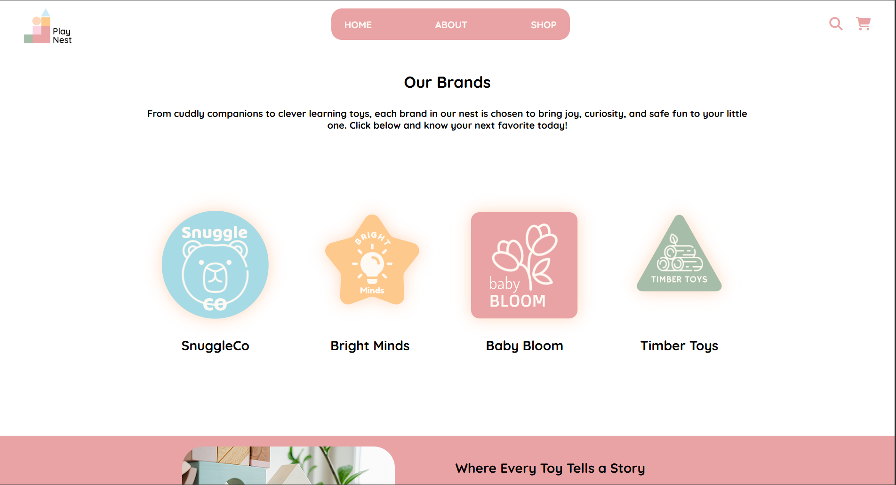

# 🧸 Toy Store Vue AJAX - Frontend & Laravel API - Backend
**Situ Ranjit & Jo Muncaster – Assignment 3**

This project is a full-stack application consisting of a Laravel backend API and a Vue-based frontend that consumes and displays toy and brand data.



---
 
## 📚 Table of Contents
- [Home](#home)
- [About](#about)
- [Shop](#shop)

---

## 📦 Project Overview

- **Frontend (Vue / AJAX)**  
  Fetches and displays data from the API.

- **Backend (Laravel API)**  
  Handles database interactions, business logic, and RESTful endpoints.

---

## 🎨 Features
- Display list of toys and brand fetched dynamically from the Laravel API
- Clickable brand names/images and "View details" button in toy section to load detailed information
- Detailed content displayed using lightbox for brand listings.
- Responsive layout for desktop and mobile
- Scroll Animation using GSAP
- Loading indicators during API requests
- Error handling for failed API calls
- Images and details pulled dynamically from backend database

---

## 🚀 Getting Started

### 1. Clone Both Repositories

```bash
git clone https://github.com/s-ranjit/ranjit_s_muncaster_j_vue-ajax
git clone https://github.com/j-muncaster/ranjit_s_muncaster_j_laravel-api
```
---

# ⚙️ Backend Setup (Laravel)

### 1. Navigate to Backend Folder
```bash
cd ranjit_s_muncaster_j_laravel-api
```

### 2. Install Dependencies
```bash
composer install
```

### 3. Create Environment File
```bash
cp .env.example .env
```

### 4. Configure Environment Variables

Open `.env` and update your database settings:

```env
DB_CONNECTION=mysql
DB_HOST=127.0.0.1
DB_PORT=8889  # (Mac MAMP) or 3306 (Windows)
DB_DATABASE=db_toy_store
DB_USERNAME=root
DB_PASSWORD=root  # (Mac) or leave empty for Windows
```

---

### 5. Create Database

- Start MAMP / WAMP / XAMPP  
- Open phpMyAdmin  
- Create a database named:

```
db_toy_store
```

---

### 6. Run Migrations & Seed Database

```bash
php artisan migrate:fresh --seed
```

---

### 7. Start Laravel Server

```bash
php artisan serve
```

Backend will run at :
```
http://127.0.0.1:8000
```

---

## 🔌 API Endpoints

### Brands

| Method | Endpoint           | Description        |
|--------|------------------|------------------|
| GET    | `/api/brands`      | Get all brands     |
| GET    | `/api/brands/{id}` | Get single brand   |
| POST   | `/api/brands`      | Create brand       |
| PATCH  | `/api/brands/{id}` | Update brand       |
| DELETE | `/api/brands/{id}` | Delete brand       |

---

### Toys

| Method | Endpoint         | Description      |
|--------|----------------|----------------|
| GET    | `/api/toys`      | Get all toys     |
| GET    | `/api/toys/{id}` | Get single toy   |
| POST   | `/api/toys`      | Create toy       |
| PATCH  | `/api/toys/{id}` | Update toy       |
| DELETE | `/api/toys/{id}` | Delete toy       |

---

# 🎨 Frontend Setup (Vue)

### 1. Navigate to Frontend Folder
```bash
cd ranjit_s_muncaster_j_vue-ajax
```

### 2. Install Dependencies
```bash
npm install
```

### 3. Run Development Server
```bash
npm run dev
```

Frontend will run at:
```
http://localhost:5173
```

---

## 🔗 Connecting Frontend to Backend

Ensure your frontend is making requests to:

```
http://127.0.0.1:8000/api
```

---

## ⚠️ Important Notes

- Make sure the Laravel server is running before starting the frontend  
- If API requests fail:
  - Check the API URL in your frontend code  
  - Ensure CORS is enabled in Laravel  
- Database must be created **before** running migrations  

---

## 🎨SASS Workflow
1. 🎛 Variables (colors, fonts, spacing)
2. 🧩 Modular Partials (abstracts, base, components, pages, etc.)
3. 🧹 Cleaned and easy to understand code and removed unwanted comments
4. 🗜 Minified output CSS

---

## 🗂️GitHub Workflow
1. 🎛 Separate branches according to pages, sections and languages.
2. 🧩Proper branch naming conventions
3. 👩🏻‍💻Work with GitHub directly with back and forth commits.
4. 📁Add .gitignore 
5. 📄Well-written README file 

---

## 🕰 History
📆 Created on **March 27, 2026**

---

## 👨‍💻 Credits
Designed and Developed by:
**Situ Ranjit** and **Josephine Muncaster** 🎨

---

## 📫Contact
Feel free to reach out to us!  

- [Situ Ranjit – LinkedIn](https://www.linkedin.com/in/situ-ranjit-187970325/)  
- [Josephine Muncaster – LinkedIn](https://www.linkedin.com/in/josephine-muncaster-382674135/)  

---

## 📄 License

MIT License  